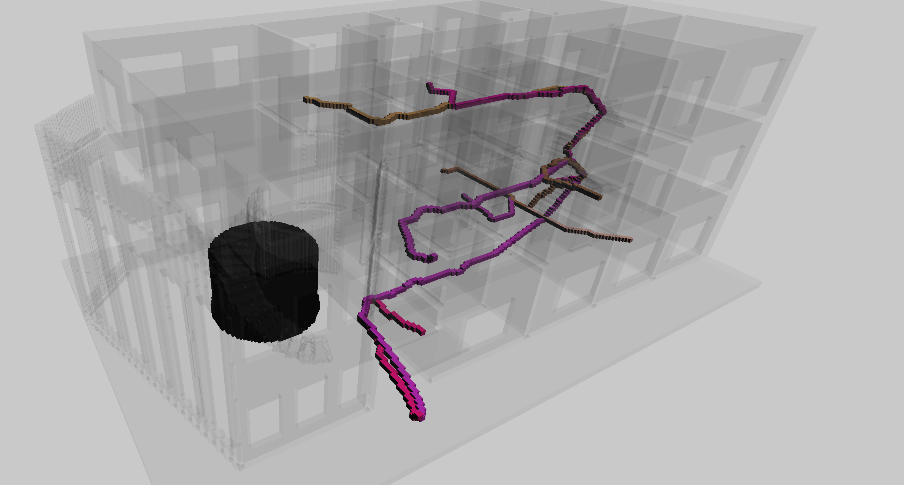
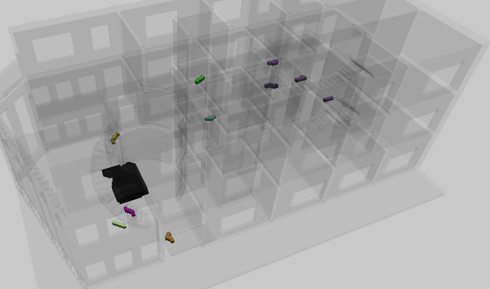

# Thesis 
Source code for the C++ application used for my thesis (Michiel de Jong) for my MSc in Geomatics of the Built Environment. 

The source is to be compiled with CMAKE on MacOS. Dependencies are Magnum, Corrade, OpenGL, DearImgui and SDL2. 

The datasets can be found in the dataset and dataset_tilted folders. All datasets are available as .txt file where they represent voxel indices, and a .obj for for more efficient rendering. 

Please note that this is not at all meant to run as a real application, and is only for testing and exploring the use of pathfinding algorithms on voxels in the context of evacuation modelling.

